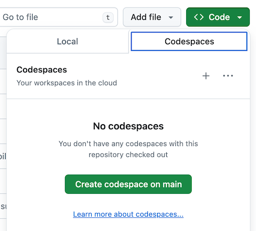

# Welcome

envelio welcomes you to this assessment project. You have now access to this GitHub repository, specifically set up for you.
In this repository you will find a web project which emulates part of the frontend and backend stack we use at envelio.

The assessment is designed to expose you to a realistic development experience at envelio. The goal of the assessment is to allow you to showcase your technical skills in both frontend and backend development without taking up too much of your time. The task should usually take around **5h**. Yet, this is only a rough time estimate which can vary depending on different factors such as personal preferences and level of detail. All in all, we set a time limit of **5 working days** for finishing the task. When finished (even if you have plenty of time left), please **inform the recruiter**, so we can start with the evaluation. Most importantly, we invite you to make this task your own and have fun. 


# Tech Stack

This repository is set up with the following tech stack:

## Backend
- [**Docker**](https://www.docker.com) as the build tool
- [**Python3**](https://www.python.org) as the backend programming language
- [**PostgreSQL**](https://www.postgresql.org) as the relational database
- [**psycopg3**](https://www.psycopg.org/psycopg3/) as the PostgreSQL database adapter
- [**fastAPI**](https://fastapi.tiangolo.com) as the web framework for building APIs 
- [**mypy**](https://mypy-lang.org/) as the static Python type checker

## Frontend
- [**Vite**](https://vitejs.dev/) as the build tool
- [**Vue 3**](https://v3.vuejs.org/) as the JavaScript component framework
- [**TypeScript**](https://www.typescriptlang.org/) JavaScript with syntax for types
- [**PrimeVue**](https://primevue.org/) open source UI components for Vue

This setup is very close to the tech stack we use at envelio. Therefore, it exposes you to a development experience that a full stack engineer at envelio encounters on a daily base. At the same time, you are free to add other packages you consider relevant (e.g. frontend utilities, linters or testing frameworks). 


# Task

As part of the agile Kanban process, the product and engineering departments conducted a backlog refinement session. During this meeting, a new feature was discussed and approved for development. The goal is to create a new web page with two views:
1. An overview that displays information about countries around the world
2. A view of the countries that the user marked as favorites

A backend engineer from your squad has already started working on the task. The required database tables are already set up and filled with all the relevant information.


## Requirements:

### Countries overview
1. **Table of all countries:** There should be a table that shows the following information for each country:
   - Name
   - Region
   - Languages
   - Population
   - A star icon button
2. **Pagination:** The table should use backend side pagination and display 20 countries per page.
3. **Sorting:** The user should be able to sort the table by country name, region or population.
4. **Filtering:** There should be an input field that allows the user to filter the table by the country's name. The API should return all partial matches of the search string (case insensitive), e.g. searching for "den" would return both "Denmark" and "Sweden".
5. **Favorite country functionality:** The user should be able to mark/unmark a country as a favorite by clicking on the star icon button. The favorite status should be persisted on backend side. As the setup of this challenge doesn't provide user handling, it is not required to support storage of favorites for individual users.
6. **Persistence of table state:** The current state of the table (current page, sorting, filtering) should be persisted when changing between the two views.

### Favorites view
**Table of favorite countries:** There should be a table that contains all countries that the user marked as favorites. The information about each country should be the same as for the countries overview. 


## Implementation Guidelines

- You have the flexibility to make design and implementation decisions according to your preferences.
- Feel free to adapt the existing setup and code to meet the requirements and align with your approach.

The expected deliverable is a branch in this repository, which contains your implementation of the task. It should be fully functional and contain the functionality described above. The code structure and content should follow typical professional standards / best practices that are known to you and that you usually practice in development, as far as they are applicable to this topic.

At envelio, we test our implementations. To ensure the task remains within a feasible scope, we ask you to only **implement a single test case**. Please decide yourself which specific **test case you consider most relevant**.


# Development setup

The provided setup uses Docker to configure the containers `dev` and `db`. The `dev` container has all required dependencies already installed. The `db` container will execute the `db/*.sql` files during initialization to fill the database with the required data. If you want to use any additional packages or containers, feel free to add them to the provided setup as you see fit.

We recommend to use one of the following development setups in order to get started quickly:

1. [Use GitHub Codespaces in the browser](#github-codespaces-in-the-browser)
2. [Connect your local VS Code to a GitHub Codespace](#local-vs-code--github-codespace)

However, you are completely free to **use your preferred development setup** for this task, e.g. run the containers locally and use another editor or IDE instead of using GitHub Codespaces and VS Code.


## GitHub Codespaces in the browser

[GitHub Codespaces](https://github.com/features/codespaces) are fully configured, secure cloud development environments native to GitHub. You can create a new codespace by simply clicking the **Create codespace on main** button.



This will create a new Codespace and open it in a new tab. The initial setup usually takes around three minutes. Once the setup is complete, a bash script will run
- a uvicorn server that serves the FastAPI backend on port 8008
- a Vite development server that serves the Vue app on port 5050

Both servers will automatically watch for changes of the source files and restart when changes are detected. 

### View output of dev container
You can see the output of the processes running in the `dev` container by executing `Cmd/Ctrl + Shift + P -> View Creation Log`.

### Change port visibility
In order for the UI to be able to access the backend, you need to set the corresponding port to public. To do so, please 
1. Execute `Cmd/Ctrl + Shift + P -> Ports: Focus on Ports View` to open the ports overview.
2. Right-click on the port `8008` and set the port visibility to `Public`. 

### View UI in the browser
To view the UI, right-click on the port `5050` in the ports overview and select `Open in browser`. This should open a simple web page with a welcome message in a new tab. If the API access is working correctly, you should see the current time displayed below the *Current database time* label inside the welcome message.


## Local VS Code + GitHub Codespace

If you prefer to use [Visual Studio Code](https://code.visualstudio.com/) locally, you can also connect your local editor to the remote codespace. To do so, make sure you have the [GitHub Codespaces extension](https://marketplace.visualstudio.com/items?itemName=GitHub.codespaces) installed.

To connect to an existing Codespace, execute `Ctrl/Cmd + Shift + P -> Codespaces: Connect to Codespace...` and select the codespace you want to connect to. 

If you haven't created a codespace yet, you can also execute `Ctrl/Cmd + Shift + P -> Codespaces: Create New Codespace...` and then select the `envelio/fullstack_coding_challenge` repository as the source for the codespace. Please make sure to follow the instructions from the previous section in order to 
- [View the process output](#view-output-of-dev-container) in the VS Code terminal
- [Set the backend port visibility](#change-port-visibility) to `Public`
- [View the UI](#view-ui-in-the-browser) in the browser


## Using Git

New Codespaces will use the `main` branch by default. You can create a new branch by executing `Ctrl/Cmd + Shift + P -> Git: Create Branch...`.


## Type checking

To type check your source code, you can run the following commands from a terminal inside the `/app` directory:

### Backend
```
mypy backend/src
```

### Frontend
```
npm run --prefix ./frontend type-check
```


## Troubleshooting

### Type definitions not available in `.vue` files
If you encounter issues with VS Code correctly resolving type definitions in `.vue` files, it might help to run `Ctrl/Cmd + Shift + P -> Developer: Reload Window`.

### API requests result in CORS errors
If API requests result in a CORS error, please double check that the [visiblity of the backend port](#change-port-visibility) is set to `Public`.
